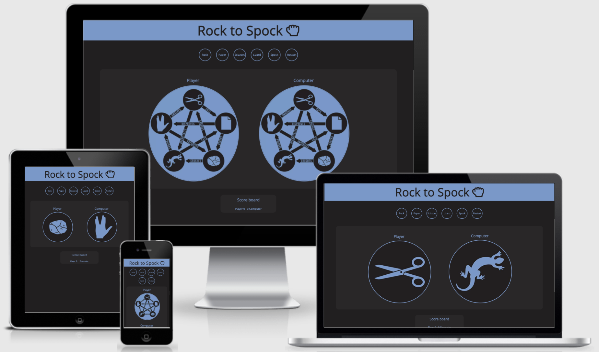
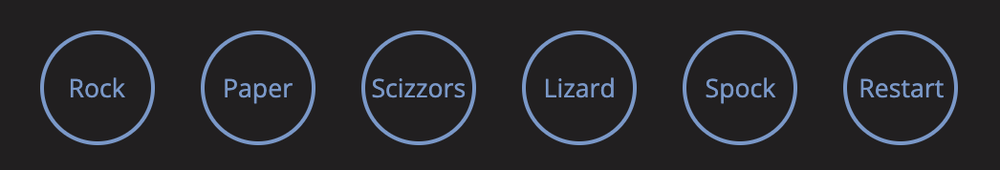
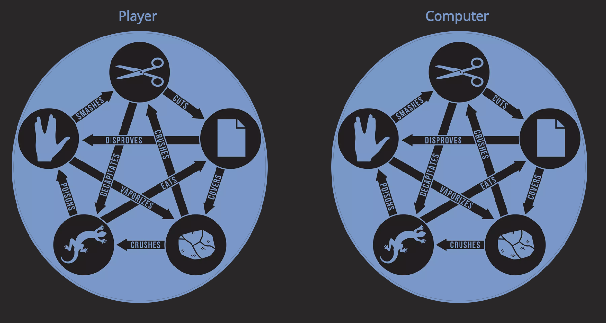
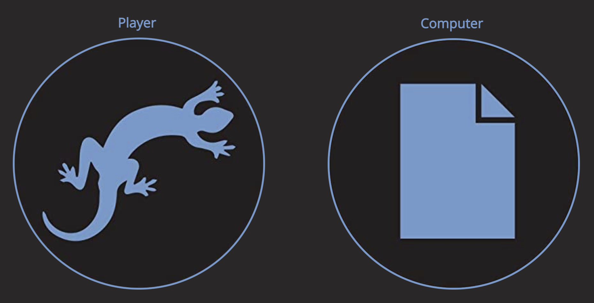
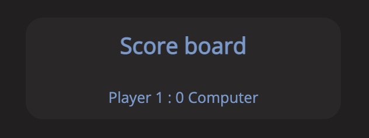

# Rock to Spock
Rock to Spock is an interesting take on the original rock, paper scizzors game. In this game there are two additional moves called *lizard* and *spock*. This adds a new dynamic to the game, allowing for new winning combinations in the game. The game is played against a computer which randomly selects moves from the available options. This allows the game to be completely random, making it difficult for the user to predict patterns.

# Features

## Existing Features

- Header
    - Starting at the beginning of the page, the header includes the game title *Rock to Spock* and also the game logo.
    - The game logo shows a closed fist to represent the move of rock. 
    - The text colour is blue up against a black background for optimal contrast.  

- Game Controls
    - This includes six buttons to select the moves of: rock, paper, scizzors, lizard and spock.
    - The buttons have the same colour scheme as the header, with blue text against a black background encircled by a blue border.
    - The buttons also rotate when the user hovers over them to indicate that they are clickable.
    - When the buttons are clicked, the game initiates and the images for the player and computer change from the rule image to the corresponding slected move.

- Game Rules
    - Before the user selects a button, the starting image for the player and computer moves shows an image explaining the rules of the game, and which win agianst other moves.

- Game Area
    - Once a move is selected by the user, the game is initiated and the player image is changed to their selected move.
    - Symultaneously and randomly the computer also selects a move to play and changes the corresponding image to match the selected move.

- Score Board
    - After the player and computer selects their moves, they are compared and then the score board keeps track of the wins of the player and computer.
    - Whilst the score is recorded, a popup is initiated to inform the user whether they *win, lose or draw* against the computer.

- Restart Button
    - The game also has a *Restart* button. The background turns blue and the colour of the text turns black when the user hovers over the button to indicate that it is different from the other buttons.
    - This button resets the game returning the player and the computer images to the starting image, showing the rules.
    - Also, resetting the score board back to zero for both the player and the computer.

## Future Feature to Implement

In the Future, I would like to make the move images for the player and computer to rotate before they change to the selected moves. This would represent how the original game is played, when the two players would say each move whilst bouncing their fists before deciding their move.

# Testing

- This site was tested on various different browsers, such as: Chrome, Firefox and Safari
- I confirm that the results are always correct
    - I have tested by playing on different devices such as Macbook, Mobile phone (Samsung), and also Ipad.
- I confirm that the header, controls, game area, score board are all legible and easy to read.
- I confirm that the colour scheme and fonts are easy to read and acesible by running the site through the Devtools lighthouse report generator.

- I confirm that the site is responsive on all devices and screen sizes. 
    - This was tested using the Chrome Devtools,
    - and also by testing the site on different devices.

## Bugs 
### Solved Bugs
- The Header, Score board text and game area text, for smaller screen sizes, was very small due using font-size in *%* units.
    - I solved this by using *rem* instead of *%*.
- On smaller screen sizes, the buttons would appear below on another, but were misaligned.
    - This was due to the buttons content width being too large for the buttons themselves on smaller devises.
    - I solved this by reducing the text of the buttons for smaller devices and changing the margins around each button.
